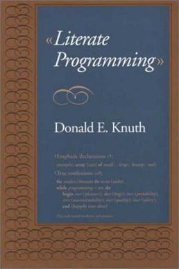

```{r setup, include=FALSE}
knitr::opts_chunk$set(echo = TRUE)
```
School of Psychology and Vision Sciences
College of Life Sciences
University of Leicester
LE1 7RH, Leicester, UK

Instructors: David Souto, Anna Nowakowska, Samantha Tyler, Mahmoud Elsherif

Contributors: David Souto, Anna Nowakowska, Tamara Gheorghes, Faye Balcombe, Mahmoud Elsherif, Callum Hunt

Main contact: 
David Souto, d.souto@le.ac.uk
Office: GDC 1.11

# Access instructions
The workshop will take place in the Maurice Shock Building (MSB). You can find access details [here](https://www.accessable.co.uk/university-of-leicester/access-guides/maurice-shock-building).

MSB 206A and 208A can be found on the second floor.**TBD** 

# Pre-session instructions 
You would have been emailed instructions. 
They can be found on the GitHub repository as well: https://github.com/DavidSouto/ReproScience-Workshop/

Troubleshooting
* Let us know if this doesnt work.
* If your installation 
* We can use the first hour of each day (Welcome) to troubleshoot issues with installation.
*** If you have issues with internet we'll have local copies of packages**

# Course description
This workshop offers a hands-on introduction to the concepts and practices of reproducible science, aimed at enhancing the integrity and reliability of research. Participants will learn about the importance of reproducibility, open science, version control (with GitHub), computational reproducibility, and data management. The program combines theoretical elements and hands-on exercises, including setting up reproducible environments, collaborative projects on GitHub, and creating reproducible analyses with analysis notebooks.

This 3-day workshop will equip participants with the essential tools and knowledge (e.g. regarding preregistration) to ensure research integrity, transparency, and reproducibility.

# Schedule at a glance

Day 1: Room, Maurice Shock (MSB) 206A

9-10am Welcome  
10-12pm Helping yourself
1pm-2:30pm Data wrangling
2:45-4pm Data visualization

Day 2: Room, Maurice Shock (MSB) 208A

9-10am Welcome
10-12pm 
1pm-2:30pm 
2:45-4pm 

Day 2: Room, Maurice Shock (MSB) 208A

9-10am Welcome
10-12pm 
1pm-2:30pm 
2:45-4pm

# Syllabus

## Day 1: Introduction to R for reproducible science
9-10am Welcome - Coffee, check installations

### Session 1: Introduction to workshop & R for Open and Reproducible science

Short intro on the importance of open and reproducible science - organization of the workshop (20-30’)

We are going to mention levels … as a way to cater for people at different stages / who have different needs. Level's 2-3 go beyond what we can cover here. You could attempt exercises  at this level if you have time left, but the idea is that Level 1 provides you with a basic and perfectly serviceable understanding of the topic for our purpose. 

Introducing the RStudio interface (20') 
<!-- TBD: could produce a video and live-code; can show setwd() tips with ".." and ".", at times opening a file does not set up the working directory correctly, 
can do getwd() to figure out where you are and use ".." to go back one or "./03_session" for instance to go one folder down-->
 
Introducing RMarkdown: Literate programming (5')

<!-- A 40 year old concept put forth by another giant of computing - write code to be understood by humans not to suit the constraints of the machine; & switching betwee the visual/source options in RStudio; could be a live-code video as well, as it will make sense to use this for exercises-->

**Exercise 1.1**: Workshop Packages
* You would have done this already, following the pre-session instructions. Otherwise go back to those instructions on top. 
* We are going to explore a few features related to the choice of packages by opening *ex1_1_packages.Rmd*

<!-- Could introduce tidyverse::broom, and tibbles, useful later as welll remember we can call functions within a package with package::function, we will sometimes use this more verbose form to avoid the pesky conflicts that come with using commmon function names across packages -->

**Exercise 1.2**: Organizing files
<!-- unfinished? -->

**Exercise 1.3**: Finding errors in scripts and functions
<!-- Level 2: Code-check -->

**Exercise 1.4**: Computational reproducibility

**Exercise 1.5**: Documenting projects with README files
<!-- basic markdown, presented, continued Exercise 2.4 -->

### Session 2: Data wrangling & consolidating
<!-- point to data management resources -->

**Exercise 2.1**: Loading datasets
Most common formats.
<!-- link to FAIR, tibbles? -->

**Exercise 2.2**: Using pipes to manipulate datasets

**Exercise 2.3**: Interactive reporting
<!-- Continuing on Rmd, could show basic output options, like saving pdf / htlm files, how to animate a graph-->
<!-- Level 2: More elaborate example of interactive reporting. https://osf.io/enxcd
 Could point to Faye's help sheets for statistical analysis-->
 
### Session 3: Data visualization
<!-- Based on live coded examples but  -->

<!-- We will be using the Finches dataset: https://www.kaggle.com/code/muhammetgamal5/darwin-s-finches-evolution
Read about the data here: https://www.kaggle.com/datasets/crbelhekar619/darwins-finches-evolution-dataset/data -->
<!-- The relationship between beak size and ecological events which has been somewhat popularised as being an example of ‘[evolution occurring before our eyes](https://books.google.co.in/books/about/The_Beak_of_the_Finch.html?id=-bbh3c4ezP0C\&redir_esc=y)’.
 -->
Short intro to GGPlot (10').

**Exercise 3.1**: GGPlot logic
<!-- Example showing how data needs to be organized -->

**Exercise 3.2**: Displaying all data
<!-- Jitter / Rainclouds - Problems with data overlay -->

**Exercise 3.4**: Publication quality plots
<!-- colour blind-friendly plots -->

## Day 2: Understanding challenges to reproducibility

9-10am Welcome - Coffee, check installations

### Session 4: Challenge to reproducibilty

What are challenges to reproducibility? (30')
- QRPs
- P-values misconceptions
- Power
  
**Exercise 4.1**: The dance of the p-values.

**Exercise 4.2**: P-hacking challenge 

**Exercise 4.3**: Multiverse analyses
<!-- https://papers.ssrn.com/sol3/papers.cfm?abstract_id=2694998
Alternative to just report the one analysis that was going your way 
Female hurricanes example: TBD give small tasks to do in addition to executing bits
https://cran.r-project.org/web/packages/multiverse/readme/README.html -->

### Session 5: Sample selection

Principled sample selection (20')
- Gpower is as an alternative

**Exercise 5.1**: Power from first principles (t-test) 
<!-- see Baker’s book.-->

**Exercise 5.2**: Power from simulation, example 1
<!-- can use reading example we mentioned from Vicky) -->

**Exercise 5.3**: Power from simulation, example 2
 
### Session 6: Strength of evidence 

'New' statistics shift in focus on precision & strength of evidence 

<!-- Idea that precision is a better indication of the strength of evidence. See also Bayesian statistics.
 -->
 
**Exercise 6.1**: Planning for precision 
<!-- Example for the mean / proportion & show precision across sample sizes. Alternatives to power calculations To think about confidence around effects (can’t be too confident effect size)-->

**Exercise 6.2**: Example of sequential testing using Bayesian statistics 
<!-- Is subject to p-hacking? mention that it still has to be a pre-defined stop rule -->

**Exercise 6.3**: Example of how sequential testing works with NHST 
<!-- show how the scenario above is problematic, but can be fixed by correcting for peeking -->

**Exercise 6.4** Are you a trend spotter?
A rather gartuituous but fun exercise to finish the day where you will learn whether you can spot the strength of a relationship.
Highest score, based on an uploaded screen copy, wins a prize.
<!-- https://www.guessthecorrelation.com/ -->

## Day 3: Sharing plans, data and code

9-10am Welcome - Coffee, check installation of GitHub Desktop / GitHub account

### Session 7: Pre-registration and registered reports (AN, ME)
**Exercise 7.1**: Identify issues. Perhaps ask to work as a group finding pre-registrations within certain repositories and evaluate within the group.

**Exercise 7.2**: Pre-registration how-to

**Exercise 7.3**: ...

### Session 8: Version Control with GitHub 
We are centering this introductin on GitHub's website and GitHub Desktop graphical interface, not git itself.

**Exercise 8.1**: Setup

**Exercise 8.2**: Cloning

**Exercise 8.2**: Committing

**Exercise 8.2**: Push / pull

**Exercise 8.2**: Merge conflict resolution 
<!-- the meme meme contest is the prize for day 3 -->

### Session 9: Publishing

Pre-printing, reporting guidelines, picking journals, peer review (15-20’)
- What's FAIR?
- private links
- parting note

**Exercise 8.1**: Publish analysis as an html page  
<!-- We have had a session to do that before. Inspiration: https://osf.io/enxcd -->

**Exercise 8.2**: Workshop feedback

<!-- Prizes and group photo -->
