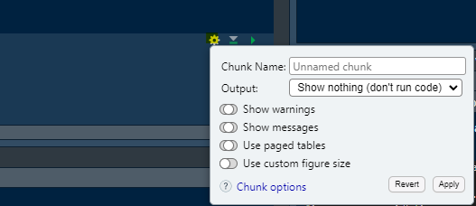
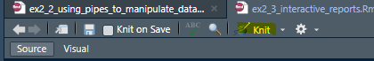

You have seem how R markdown documents work across our exercises. We are now going to look at how R markdown documents can be used to generate literate code by getting a better understanding of code chunks.

```{r, echo=TRUE}
# We are going to start by loading our data and set working directories

# Run this chunk unless you have run Exercise 2.1
# The working directory needs setting to day1/02_session 
library(tidyverse)

tt_data <- read.csv("./data/tiktok_data.csv")
```

# Inserting images in your document

You can insert an image in your document this way: alt text between [], followed by image path in between (), width and height (optional) between {}

{width=300px, height=300px}

# Understanding code chunks

You know chunks already. They are the bits prefaced by "```{r}", whic specifies that a piece of text has to be interpreted as code. Now we can look at a few common options for chunks. Code chunks are the building blocks of R Markdown documents. 

# Chunk options

Other options for chunks can be access through the chunk options menu.

For instance. Ask to "not run" the last chunk of this document by checking the chunk options (cogwheel). 


If you don't do that the code won't compile, because it contains erroneous code (blanks to fill).

At the same time that you go through the output options, I'd like you to observe the changes in the line introducing the chunk ````{r}`. Based on this what is the meaning of `include` and `echo`?

Change the chunk on top of this document so it doesn't `echo`.

# Inline code

You can also run code inline with the text. If I type 'r 5*5' but with a **grave accent** ("`"), it will be interpreted as r-code and shown as 25 in the Knitted document (see below). 

# Knitting your document

Finally you want to knit your document. You can do so with the knit button. Explore the options. 



# Level 2 (optional): Example of using animate 

We can spice things up by animating your data. Fill the blanks in this chunk to plot likes count versus view count per author ban status (hint: variable types may need adjusting)

```{r eval=FALSE, include=FALSE}
# Load necessary library for creating GIFs, comment once installed
# install.packages("animation")
library(animation)
library(tidyverse)
# Create a simple animated scatter plot of the tiktok dataset
# Set up the animation parameters
saveGIF({
  
  # You can use a for loop to go through
  # author status 
  # note that unique() allows you to select unique values of a variable
  for (n in unique(tt_data$author_ban_status)) {
    # Subset the data by author ban status
    subset_data <- tt_data %>% filter(author_ban_status==n)
    
    #browser()
      
    # Create the scatter plot
    plot(, ,
         main = paste("Likes per view count"),
         xlab = "Video Likes Count",
         ylab = "Video View Count",
         pch = 19, col = "blue", cex = 1.5)
    
    # Add a grid for better visualization
    grid()
    
    # Pause for a moment to create the animation effect
    Sys.sleep(1)  # Pause for 1 second
  }
}, movie.name = "images/status_effect.gif", interval = 1, ani.width = 600, ani.height = 400)


saveGIF({
  
  # Loop through unique author ban statuses
  for (n in unique(tt_data$author_ban_status)) {
    # Subset the data by author ban status
    subset_data <- tt_data %>% filter(author_ban_status == n)
    
    # Create the scatter plot
    plot(subset_data$likes_count, subset_data$view_count,
         main = paste("Likes per view count for", n),
         xlab = "Video Likes Count",
         ylab = "Video View Count",
         xlim = c(1,10),
         ylim = c(0,10),
         pch = 19, col = "blue", cex = 1.5)
    
    # Add a grid for better visualization
    grid()
    
    # Pause for a moment to create the animation effect
    Sys.sleep(1)  # Pause for 1 second
  }
}, movie.name = "status_effect.gif", interval = 1, ani.width = 600, ani.height = 400)

```

Finally insert the gif in this document using the method we saw above.

Key Takeaways

Code Chunks: Use code chunks to run R code and display results in your report.
Inline Code: Incorporate R code directly into your text for dynamic reporting.
Visualizations: Enhance your reports with plots and charts to illustrate your findings.

Additional Resources

Explore more about R Markdown and its capabilities in the [official documentation](https://rmarkdown.rstudio.com/lesson-1.html).

