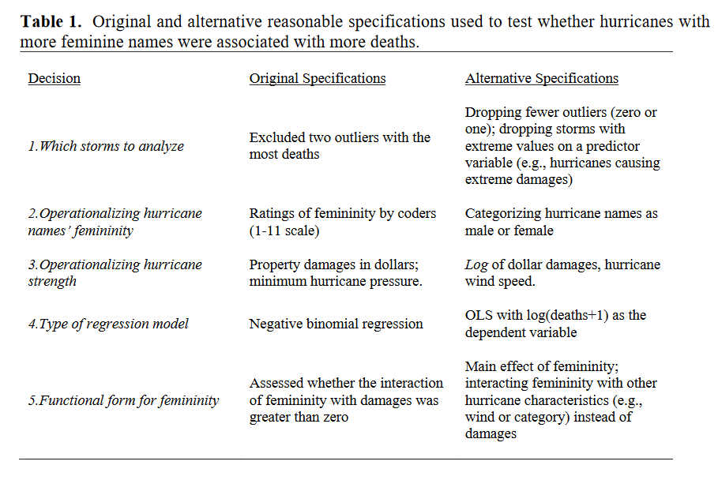
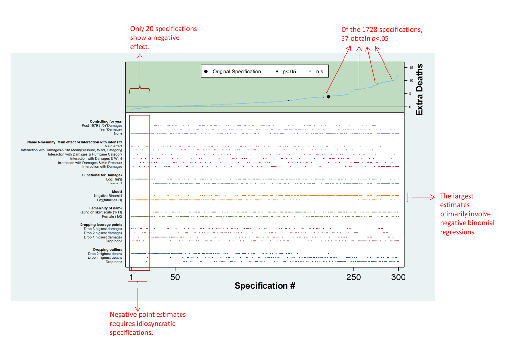

This exercise is based on this: https://rdrr.io/cran/multiverse/f/vignettes/example-hurricane.Rmd

Other fully worked example: https://cran.r-project.org/web/packages/multiverse/vignettes/visualising-multiverse.html




We are going to use the specr package to implement a basic multiverse analysis. A more complex package is multivers, where you will see a vignette that implements the "female hurricane" analysis  

```{r setup, include=FALSE}

knitr::opts_chunk$set(echo = TRUE, message = FALSE, warning = FALSE) 

# Install required packages if needed 
# Load packages library(specr) library(tidyverse) library(ggplot2)
if (!require("specr")) install.packages("specr") 
if (!require("tidyverse")) install.packages("tidyverse") 
if (!require("ggplot2")) install.packages("ggplot2") 

```

Task 1.1: Load and Examine the Dataset

# Load the example dataset data("example_data") # Display the first few rows of the dataset head(example_data) # Check the structure of the dataset str(example_data)

We are going to use a pre-processed version of the hurricane data

TBD. Package the data for the workshop and simplify structure

```{r , include=FALSE}
# read and process data
hurricane_data <- hurricane |>
    # rename some variables
    rename(
        year = Year,
        name = Name,
        dam = NDAM,
        death = alldeaths,
        female = Gender_MF,
        masfem = MasFem,
        category = Category,
        pressure = Minpressure_Updated_2014,
        wind = HighestWindSpeed
    ) |>
    # create new variables
    mutate(
        post = ifelse(year>1979, 1, 0),
        zcat = as.numeric(scale(category)),
        zpressure = -scale(pressure),
        zwind = as.numeric(scale(wind)),
        z3 = as.numeric((zpressure + zcat + zwind) / 3)
    )

df <- hurricane_data |>
    filter( name != "Katrina" & name != "Audrey" )

# SAVE FOR THE WORKSHoP
```

Exercise 2: Setting Up Specifications

```{r , include=FALSE}

fit <- glm(death ~ masfem * dam + masfem * zpressure, data = df, family = "poisson")

Task 2.1: Define Analytical Choices

# ```{multiverse label = default-m-3, inside = M}
# fit <- glm(branch(model, "linear" ~ log(death + 1), "poisson" ~ death) ~ 
#           branch(main_interaction,
#               "no" ~ femininity + damage,
#               "yes" ~ femininity * damage
#           ) + branch(other_predictors,
#               "none" ~ NULL,
#               "pressure" %when% (main_interaction == "yes") ~ femininity * zpressure,
#               "wind" %when% (main_interaction == "yes") ~ femininity * zwind,
#               "category" %when% (main_interaction == "yes") ~ femininity * zcat,
#               "all" %when% (main_interaction == "yes") ~ femininity * z3,
#               "all_no_interaction" %when% (main_interaction == "no") ~ z3
#           ) + branch(covariates, "1" ~ NULL, "2" ~ year:damage, "3" ~ post:damage), 
#           family = branch(model, "linear" ~ "gaussian", "poisson" ~ "poisson"),  
#           data = df)

# 
# 
# data	
# The data set that should be used for the analysis
# 
# x	
# A vector denoting independent variables
# 
# y	
# A vector denoting the dependent variables
# 
# model	
# A vector denoting the model(s) that should be estimated.
# 
# controls	
# A vector of the control variables that should be included. Defaults to NULL.
# 
# subsets	
# Specification of potential subsets/groups as list. There are two ways in which these can be specified that both start from the assumption that the "grouping" variable is in the data set. The simplest way is to provide a named vector within the list, whose name is the variable that should be used for subsetting and whose values are the values that reflect the subsets (e.g., ⁠list(group2 = c("female", "male")⁠). In this case, the specifications will includes "all", "only female" and "only male". Alternatively, you can also use the unique function to extract that vector directly from the data set (e.g., ⁠list(group2 = unique(example_data$group2⁠). Both approaches lead to the same result. The former, however, has the advantages that one can also remove some of the subgroups (e.g. ⁠list(group2 = c("female")⁠). In this case, the specifications will include "all" (no subset) and "only females". See examples for more details.
# 
# add_to_formula	
# A string specifying aspects that should always be included in the formula (e.g. a constant covariate, random effect structures...)
# 
# fun1	
# A function that extracts the parameters of interest from the fitted models. Defaults to tidy, which works with a large range of different models.
# 
# fun2	
# A function that extracts fit indices of interest from the models. Defaults to glance, which works with a large range of different models. Note: Different models result in different fit indices. Thus, if you use different models within one specification curve analysis, this may not work. In this case, you can simply set fun2 = NULL to not extract any fit indices.
# 
# simplify	
# Logical value indicating what type of combinations between control variables should be included in the specification. If FALSE (default), all combinations between the provided variables are created (none, each individually, each combination between each variable, all variables). If TRUE, only no covariates, each individually, and all covariates are included as specifications (akin to the default in specr version 0.2.1).
# data	
# The data set that should be used for the analysis
# 
# x	
# A vector denoting independent variables
# 
# y	
# A vector denoting the dependent variables
# 
# model	
# A vector denoting the model(s) that should be estimated.
# 
# controls	
# A vector of the control variables that should be included. Defaults to NULL.
# 
# subsets	
# Specification of potential subsets/groups as list. There are two ways in which these can be specified that both start from the assumption that the "grouping" variable is in the data set. The simplest way is to provide a named vector within the list, whose name is the variable that should be used for subsetting and whose values are the values that reflect the subsets (e.g., ⁠list(group2 = c("female", "male")⁠). In this case, the specifications will includes "all", "only female" and "only male". Alternatively, you can also use the unique function to extract that vector directly from the data set (e.g., ⁠list(group2 = unique(example_data$group2⁠). Both approaches lead to the same result. The former, however, has the advantages that one can also remove some of the subgroups (e.g. ⁠list(group2 = c("female")⁠). In this case, the specifications will include "all" (no subset) and "only females". See examples for more details.
# 
# add_to_formula	
# A string specifying aspects that should always be included in the formula (e.g. a constant covariate, random effect structures...)
# 
# fun1	
# A function that extracts the parameters of interest from the fitted models. Defaults to tidy, which works with a large range of different models.
# 
# fun2	
# A function that extracts fit indices of interest from the models. Defaults to glance, which works with a large range of different models. Note: Different models result in different fit indices. Thus, if you use different models within one specification curve analysis, this may not work. In this case, you can simply set fun2 = NULL to not extract any fit indices.
# 
# simplify	
# Logical value indicating what type of combinations between control variables should be included in the specification. If FALSE (default), all combinations between the provided variables are created (none, each individually, each combination between each variable, all variables). If TRUE, only no covariates, each individually, and all covariates are included as specifications (akin to the default in specr version 0.2.1).

# Create a specification setup 
specs <- setup( data = example_data, y = c("y1", "y2")
                
                # Dependent variables x = c("x1", "x2"), 
                # Independent variables controls = c("c1", "c2"), 
                # Control variables subsets = list(group1 = unique(example_data$group1), group2 = unique(example_data$group2)) 
                # Grouping variables ) # Overview of specifications summary(specs)

Exercise 3: Running the Analysis

Task 3.1: Execute Specification Curve Analysis
# Run the specification curve analysis 
results <- specr(specs) # Summarize results summary(results)

Exercise 4: Visualization
Task 4.1: Create Specification Curve Plot
# Create a basic specification curve plot plot(results)

# For extra pazzazz, animation

summary(M)

Questions ...

Further ... Keep in mind when you read a bout choices that appear arbitrary in any analysis. See many analysts.

Hint ...


