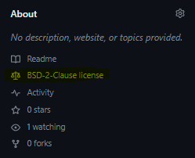

# A crash-course on GitHub
#### David Souto / 2023-07-09

This is a (very belated) handout for the 50 mn Coding club @ SoPVS on GitHub. You can find the materials from previous sessions [here](https://osf.io/94jyp/wiki/6.%20Coding%20club/).

## Introduction 

The goal of the session is to show you how to use GitHub to share your code (or documentation) and use it as a way to collaborate with people efficiently. We shall see that we can grasp the basic functionality in short time. Going through all the intricacies would take a lot longer, but one of the reasons GitHub is so popular is that it simplified version-control via _git_ for most common tasks. For instance, we can synchronize files via a visual interface (GitHub Desktop) instead of using the command line. 

For small projects, where you often have 1-2 people working on code, this crash course should be enough to get you started. Even if you don't intend to publish your code GitHub is a good way of keeping track of versions and sharing it with future collaborators as you will be ale to revert to previous versions & resolve conflicts more easily than if everyone had independent copies, with file dates and names ("analysis_last_final_v5.R") as the only way to keep track of the last version.

Other advantages of using GitHub:
- Facilitates collaboration with others.
- Allows you to back up your code online (not the data)  
- Allows to showcase your work and keep track of how people interact with it;  providing proof of impact.

## Setting up a GitHub Account and GitHub Desktop

You can follow this session without the pro version of GitHub, but if you want to be able to create private repositories before sharing them with the world you will need one.

* Create an education account by picking the “student” option [here](https://education.github.com/discount_requests/application), it will work for staff as well. Then sign-in.
* Download [GitHub Desktop & install](https://desktop.github.com/).

## Getting started

We can start with a repository that you can access [here](https://github.com/DavidSouto/playground):

Click on **commits** (highlighted) to check the history of changes. You are able to see what changes I have made to my  _playground_ **repository** (or **repo**). You see a short description of the changes I have made. If you click on one of them you can see exactly what was changed. You see "+" or "-" signs by every line indicating whether there was an addition of text or removal. By hovering your mouse at the beginning of each line you can also leave comments. I have made the playground repository so you can feel free to modify it, fork, clone, etc. 

## Creating a repository

There are a few ways of creating a new repository. We start by going to my profile then select the "repositories" tab. When we press "new" repository button we have a few options. We can give the repository a name and decide whether it is public or private. 

You then have three options. We could press "set up in Desktop". This will generate a local copy of the repository in your computer. However, what we want now is start from code that is already out there, so instead we'll ask to "import code":

Note how we could do all of this from the command line. We will be avoiding git commands altogether this in this crash course.
  
That way we can ask to populate the new repository with the playground code: https://github.com/DavidSouto/playground

When I ask to "begin import", I have now a new repository I called "test2" in can find in my profile and repository list. A few things to note about this repository. It is not connected to the original repository in that I cant ask for changes to be merged with the original one. However it lists everyone who contributed to the repository and every change made.

The code itself corresponds to an HTML template website made by Vasilios Mavroudis. I can use it because because it was shared under a license that allows me to. You can click on the "BSD-2-Clause license" link to see the conditions. Basically, you are allowed to reuse as long as you keep the origina lincense. I also kept the disclaimer at the end from the original version.

This is the simplest website template I could find. By simple I mean that all the text lives in a single HTML file (index.html). There is a minimal amount of code for aesthetics and navigation. I actually made it a tad simpler by removing the "home" tab becase as we can go backwards on the browser. We have one folder for pdfs and one folder for images or videos. It gets a while to get used to it but from experience it is a lot quicker to make small changes (add a reference) that way than relying on a visual interface (e.g. wordpress, weebly, etc.).

## Cloning a repository

We are not going to change the code online, that is often quite unpractical but we could if it is just a small thing. I could select the "index.html" file and click the edit button on the top right corner. 

More conveniently I can make a local copy, or **clone**, on my computer. 

This will open GitHub Desktop. I can then decide where to save the clone of the repository locally: 

## GitHub Desktop 

You can do a few things on GitHub Desktop, such as create a local repository or ask to clone a repository. We could have gone File > Clone repository to do what we have done with _playground_. Here are a few elements:

_In red_: If you click Options you can pick the editor you want to use to edit the code from here. I chose Visual Studio Code because it is very polyvalent. RStudio can be another choice.

_In blue_: This shows you the actions that are available to you in relation to the remote repository (the "test2" that lives under my GitHub list or repositories). When you get started the only option is **fetch origin**. Try clicking on it, it won't do a thing unless we changed something to the repository. Let's try a change. We go online and modify "index.html" to say "Visuomotor Laboratory" instead of lab (make sure you are changing your version of the repository). On the top right corner we **commit changes** and explain what those changes are. Let's now do a **fetch origin** on GitHub Desktop. This allowed you to get the changes between local and remote repositories. You now have a nother option: **pull origin**. By pressing pull origin now you recover the last version of the code locally. 

_In orange_: You can click on "History" and see all the changes to the repository from its creation. On changes you can see what files have changed locally. Go now your editor and change again "index.html". You see that immediatly changes are being pointed to you on GitHub Desktop.  

_In green_: This is how you can commit changes. Unless you commit you won't be able to "push" changes to the remote repository. You can do this at the end of the day as a way to backup your code and document the changes for yourself and others. At the minimum you need a word in the "summary" section, e.g. typos. Then click "commit to master". Now you have another option on GitHub Desktop (blue area). That is to **push to origin**. Now the remote repository is in synch with your local repository. 

## Forking a repo: bringing a repository to your GitHub space

Forking creates a personal copy of someone else's project on GitHub, whereas Cloning is making a local copy on your computer.

You can see how forking **Forked** repositories are connected to the original repository. Find a repositury on GitHub you could be interested in and fork it. 

## Collaborating with others 

### Contributor vs Collaborator

“The one special privilege a collaborator has over a contributor is that they can push _directly_ to _your_ repository (since you have [added them as "collaborator"](https://help.github.com/en/github/setting-up-and-managing-your-github-user-account/inviting-collaborators-to-a-personal-repository)).”

As opposed to a contributor, [who has to fork your repository first](https://help.github.com/en/github/getting-started-with-github/fork-a-repo), and make a pull request from their own fork/branch to your repo/master branch.

You can invite collaborators to your repository by going to "settings" and "collaborators" (top left menu) and enter their email.

TBD: Overview of branching and **pull requests**

### The main branch

We didn't talk at all about branches. Creating a new branch from the main branch.

On GitHub Deskptop and remotely you have this notion that you are on the main branch. But it doesn't necessarily have to be.

## Dangerous actions

What happens if you forked a repository and you fetch the origin? We risk squishing other people's work. 

## Collaboration and sharing

### Integration with OSF

Another nice feature of GitHub is that you can link your repository to the [Open Science Framework website](https://osf.io/). This is preferable to simply uploading code to the website, you can then use GitHub's version control and make your code a lot more findable. I am not going through this in detail. I'll just note that the procedure is quicker [than it looks](https://help.osf.io/article/211-connect-github-to-a-project#:~:text=Find%20GitHub%20in%20the%20%22Configure,a%20member%20of%20the%20organization).

### Licensing
Licensing is an essential consideration when sharing code. The Creative Commons 4.0 license is something you see more and more in association with educational resoruces or articles. It is a very unrestrictive license, you simply need to attribute authorship and re-share with the same license. This is not always appropriate for code.The website we cloned has a BSD-2-Clause license, which is common for code.  You can read here about **common licenses**.

## Further resources
If you are planning to use GitHub to launch large collaborative projects you may want to read about how to resolve merge conflicts, about tags and managing collaborators. 

There are better introductions for more advanced uses of GitHub. A good resrouces could be **TBD**.

## Conclusion

## Glossary 

**Repository** or **repo**: This is the folder where you keep your code. You can have a repo on Github or locally, on your computer, which you want to keep in synch.

**Target repository:** The specific repository to which changes are intended to be pushed or pulled.

**Committing**: You do your thing and after a while you decide that you want to record the changes you have made. This is committing and it involves describing the changes.

**Forking**: Making a copy of a remote repository. By forking you will be later request those changes to be merged with the original repository. 

**Cloning**: Making a local copy of a remote repository (whether it has been forked or not).

**Fetch origin**: Locally, you make sure that you have the newest files of the online repository by **fetching the origin**.

**Push**: You send your committed changes to a remote repository. This updates the remote repository with the changes you've made locally.  

**Pull origin**: Locally, you use the pull command to  fetch changes from the remote repository and merge them into your local copy to keep everything synchronized.

**Pull request**: You made some changes to a forked repo (basically you are working on a parallel version of the code), then you make a **pull request** to ask to the original repository owner to consider those changes to be incorporated to the original repository.

## Feel free to reuse / comment

I made this as an _*.md_ document with with a neat markdown editor called Zettlr (shout out to [Stefano de Sabbata](https://sdesabbata.github.io/)), then exported it as an _*.html_ file. 

Don't hestiate to email me if you spot a mistake: d.souto@le.ac.uk

This work is licensed under a [Creative Commons Attribution 4.0 International License](https://creativecommons.org/licenses/by/4.0/).

