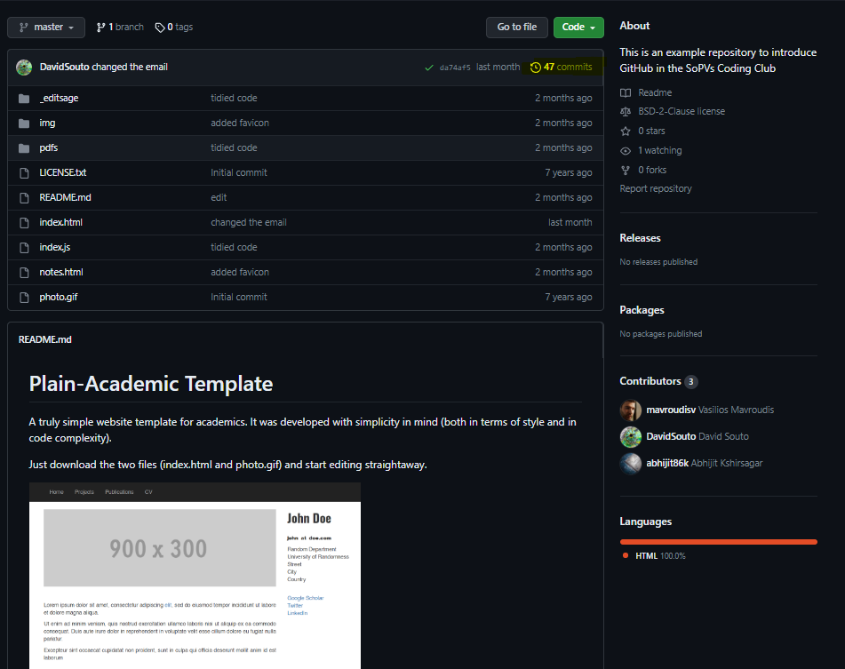

Introduction

The goal of this worksheet is to set things up and explore repositories
on the GitHub website

# Setting things up

Setting up a GitHub Account and GitHub Desktop

You can follow this session without the pro version of GitHub, but if
you want to

be able to create private repositories before sharing them with the
world you will need one.

You should already have an account. If you don't you can create a free
account or an education account by picking the “student” option here, it
will work for staff as well. Then sign-in.

Download GitHub [Desktop & install](https://github.com/apps/desktop).

# Getting started

We can start with a repository that you can access
[here](https://github.com/DavidSouto/playground)

This is a screen copy of the **public** repository. Hover over the image link to see it in the "Source" mode or to view a bigger version of this image switch to "Visual" on RStudio:

Take a few minutes to explore the different pieces of information that you can see
on the repository website. We are going to focus on the "Code" tab.

Starting with options on top: Can you figure out what the "pin" does, "watching", "forking", "Starring".

Next level, what does "master" mean? 

Next hover over the "Update index.html". What does this show?

You then have a list of files, next to which you see arcane comments and then dates.
Click on one of them. For instance the "Update index.html". Do you understand what
it shows? What could this possibly mean "@@ -7,7 +7,7 @@"? Make a comment. What options you see for comments?

Now click on the corner that says "48 commits" (highlighted) to check the history of changes. You are then able to see what changes I have made to my playground repository (or repo). 

You see a short description of the changes I have made. If you click on one of them you can see exactly what was changed. You see “+” or “-” signs by every line indicating whether there was an addition of text or removal. By hovering your mouse at the beginning of each line you can also leave comments. 

I have made the playground repository so you can feel free to modify it, fork, clone, etc.

Have a look at the README section. It shows the formatted contents of the README.md file as we have seen before. 

Look at the right-hand side information. You can see contributors. Information about deployment (more on this later) and the languages involved.

You can see that this repository is not something I created from scratch. Go to the 
"commits" again and start from the bottom. You can see Vasilios Mavroudis created
the website template. I then made changes to it. I had several choices before me:
-I could create a "fork" (more on this later), allowing me to later merge with the main repository. Aven if I don't plan to merge it can show appreciation of people's work.
-I could also download a copy and create a repository that is unlinked to the main repository. It still shows who did what. I am doing this here instead of forking because I can uses it as a playground.

Go to the Vasilios Mavroudi's profile and see his plain-academic repository. If you want later on to use it for yourself, use the "forking".

Finally you can click on the license link in the "About" section. Can you see how
the license applies to sharing code? Is it very permissive regarding sharing? Do you specify the author?

# Editing things
You are not really meant to do the editing of your files on GitHub, but you can make small tweaks. That's the easy way to contribute to a repository or change something in your repository. You will be asked to fork the repository (quick) to be able to make a "pull request" to apply the change. 

Try making a change to the README file by clicking on the pencil on the top right corner. What happens? What is a pull request? We'll figure this later on. 

You can click on add file as well (top right of code section) and see what happens.

Next we want to see how to create a repository of our own, fork it (create a parallel version we can request OR NOT to join to the original later on), or clone a repository.
