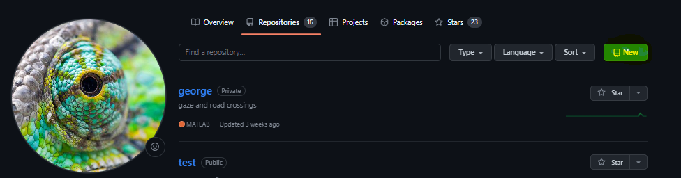
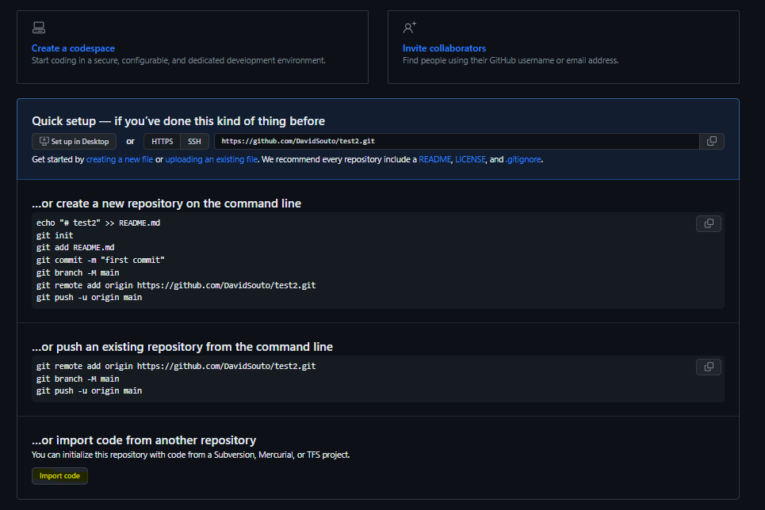
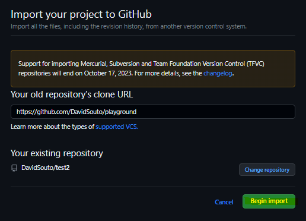
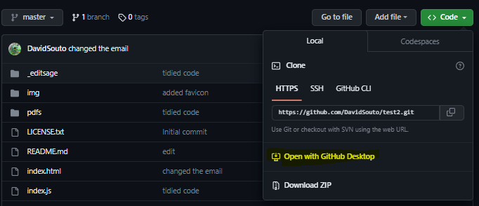
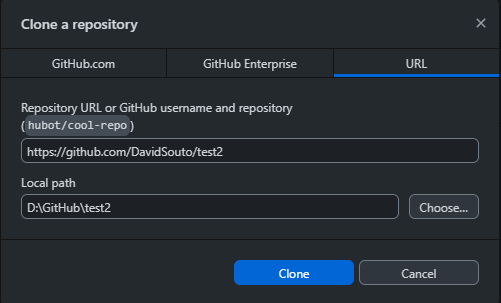

## Creating a repository

There are a few ways of creating a new repository.

Note how we could do all of this from the command line. We will be avoiding git commands altogether in this crash course.

The philosophy of the workshop is to teach you first the essentials. But they go a long way. The inventor of git only uses mostly 5 actions, which can be done no less efficiently through software ["Git turns 20: A Q&A with Linus Torvalds](https://github.blog/open-source/git/git-turns-20-a-qa-with-linus-torvalds/).

# Let's start with a repository created through the GitHub website

We start by going to your profile then select the "repositories" tab. When we press "new" repository button we have a few options. We can give the repository a name and decide whether it is public or private.

You then have three options. We could press "set up in Desktop". This will generate a local copy of the repository in your computer.

However, we could start with code that is already out there, so instead we'll ask to "import code":

That way we you can ask to populate the new repository with the playground code: <https://github.com/DavidSouto/playground>

When you ask to "begin import", you have now a new repository I called "test2", which you can now find in your profile and repository list.

A few things to note about this repository. As we mentioned before about my version of the plain-academic repository. It is not connected to the original repository in that I cannot ask for changes to be merged with the original one. However it lists everyone who contributed to the repository and every change made.

Another aside: This is the simplest website template I could find. By simple I mean that all the text lives in a single HTML file (index.html). There is a minimal amount of code for aesthetics and navigation. I actually made it a tad simpler by removing the "home" tab because as we can go backwards on the browser. We have one folder for pdfs and one folder for images or videos. It gets a while to get used to it but from experience it is a lot quicker to make small changes (add a reference) that way than relying on a visual interface (e.g. wordpress, weebly, etc.).

## Cloning a repository

We are not going to change the code online, that is often quite unpractical but we could if it is just a small thing. I could select the "index.html" file and click the edit button on the top right corner.

More conveniently I can make a local copy, or **clone**, on my computer.

This will open GitHub Desktop. I can then decide where to save the clone of the repository locally:

 

You see I have a folder called GitHub close to the "root" of the drive (D:) where I keep all my repositories.

Next open GitHub Desktop and explore its features in the next worksheet.
