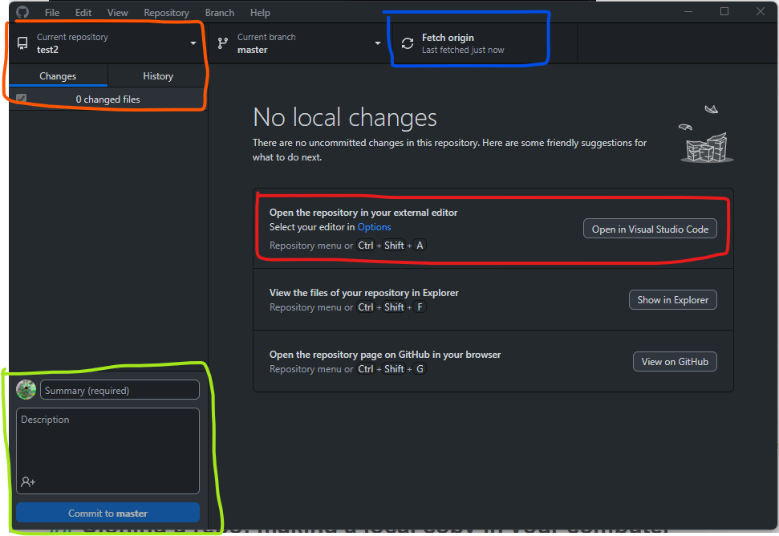

We can now have a tour of GitHub Desktop's features.

## GitHub Desktop 

You can do a few things on GitHub Desktop, such as create a local repository or ask to clone a repository. We could have gone File > Clone repository to do what we have done with _playground_. Here are a few elements:

_In red_: If you click Options you can pick the editor you want to use to edit the code from here. I chose Visual Studio Code because it is very polyvalent. You don't have to use it, but it can be a convenient shortcut.

_In blue_: This shows you the actions that are available to you in relation to the remote repository (the "test2" that lives under my GitHub list or repositories). 

The two other options below are *View the files of your repository in Explorer* and *Open the repository page on GitHub in your browser*. Try both! Any other way of locating your repository or files will take a lot more time. Keep this in mind.

_In orange_: You can click on "History" and see all the changes to the repository from its creation. On changes you can see what files have changed locally. Since there are no changes it doesn't show anything interesting right now.

_In green_: This is how you can **commit** changes. Unless you **commit** you won't be able to **push** your local changes (changes in yoru computer) to the remote repository (GitHub website). You don't have to do this every time you change something of course. However, it makes sense to **commit** at every stage you want to document or go back to. In the playground example I committed at times small things so the website the repository is linked to could update. 

# Fetch

When you get started the only option is **fetch origin**. Try clicking on it, it won't do a thing unless we changed something to the repository. 

Let's try a change. We go online and modify "index.html" to say "Visuomotor Lab" instead of Laboratory (make sure you are changing your version of the repository). 

On the top right corner we **commit changes** and explain what those changes are. Let's now do a **fetch origin** on GitHub Desktop. This allowed you to get the changes between local and remote repositories. You now have a nother option: **pull origin**. By pressing pull origin now you recover the last version of the code locally. 

Go now your editor and change again "index.html". You see that immediately changes are being pointed to you on GitHub Desktop. 

# Commit

To **commit** (green area) you require at least to provide a **summary** but not necessarily a description. The summary can be one word: e.g. *typos*. "commit to master". Now you have another option on GitHub Desktop (blue area). 

That is to **push to origin**. 

# Push to origin 

Once you have made your first *commit* you see another option in the red area. 

Now the remote repository is in synch with your local repository. 

# Pull origin

If you have remote changes. For instance, you have done some changes on another computer that you have pushed remotely, GitHub Desktop will
tell you that there are remote changes to need to *pull* before you *push* your changes online.

# Branches

# Creating repositories from GitHub Desktop

# Forking a repository

Forking creates a personal copy of someone else's project on GitHub, whereas Cloning is making a local copy on your computer.

We'll see how this works when well talk about merge conflict resolution & pull requests in exercise 8.6.

You can see how forking **Forked** repositories are connected to the original repository. Find a repository on GitHub you could be interested in and fork it. 

## Collaborating with others 

### Contributor vs Collaborator

“The one special privilege a collaborator has over a contributor is that they can push _directly_ to _your_ repository (since you have [added them as "collaborator"](https://help.github.com/en/github/setting-up-and-managing-your-github-user-account/inviting-collaborators-to-a-personal-repository)).”

As opposed to a contributor, [who has to fork your repository first](https://help.github.com/en/github/getting-started-with-github/fork-a-repo), and make a pull request from their own fork/branch to your repo/master branch.

You can invite collaborators to your repository by going to "settings" and "collaborators" (top left menu) and enter their email.

TBD: Overview of branching and **pull requests**

### The main branch

We didn't talk at all about branches. Creating a new branch from the main branch.

On GitHub Deskptop and remotely you have this notion that you are on the main branch. But it doesn't necessarily have to be.

## Dangerous actions

What happens if you forked a repository and you fetch the origin? We risk squishing other people's work. 

## Collaboration and sharing

### Integration with OSF

Another nice feature of GitHub is that you can link your repository to the [Open Science Framework website](https://osf.io/). This is preferable to simply uploading code to the website, you can then use GitHub's version control and make your code a lot more findable. I am not going through this in detail. I'll just note that the procedure is quicker [than it looks](https://help.osf.io/article/211-connect-github-to-a-project#:~:text=Find%20GitHub%20in%20the%20%22Configure,a%20member%20of%20the%20organization).

### Licensing
Licensing is an essential consideration when sharing code. The Creative Commons 4.0 license is something you see more and more in association with educational resources or articles. It is a very nonrestrictive license, you simply need to attribute authorship and re-share with the same license. This is not always appropriate for code.The website we cloned has a BSD-2-Clause license, which is common for code.

## Glossary 

**Repository** or **repo**: This is the folder where you keep your code. You can have a repo on Github or locally, on your computer, which you want to keep in synch.

**Target repository:** The specific repository to which changes are intended to be pushed or pulled.

**Committing**: You do your thing and after a while you decide that you want to record the changes you have made. This is committing and it involves describing the changes.

**Forking**: Making a copy of a remote repository. By forking you will be later request those changes to be merged with the original repository. 

**Cloning**: Making a local copy of a remote repository (whether it has been forked or not).

**Fetch origin**: Locally, you make sure that you have the newest files of the online repository by **fetching the origin**.

**Push**: You send your committed changes to a remote repository. This updates the remote repository with the changes you've made locally.  

**Pull origin**: Locally, you use the pull command to  fetch changes from the remote repository and merge them into your local copy to keep everything synchronized.

**Pull request**: You made some changes to a forked repo (basically you are working on a parallel version of the code), then you make a **pull request** to ask to the original repository owner to consider those changes to be incorporated to the original repository.

# Additional resources

There are better introductions for more advanced uses of GitHub. A good resources could be **TBD**.
