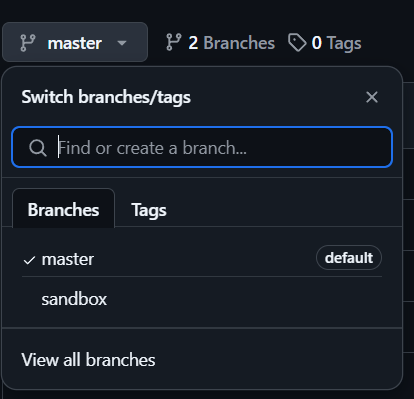
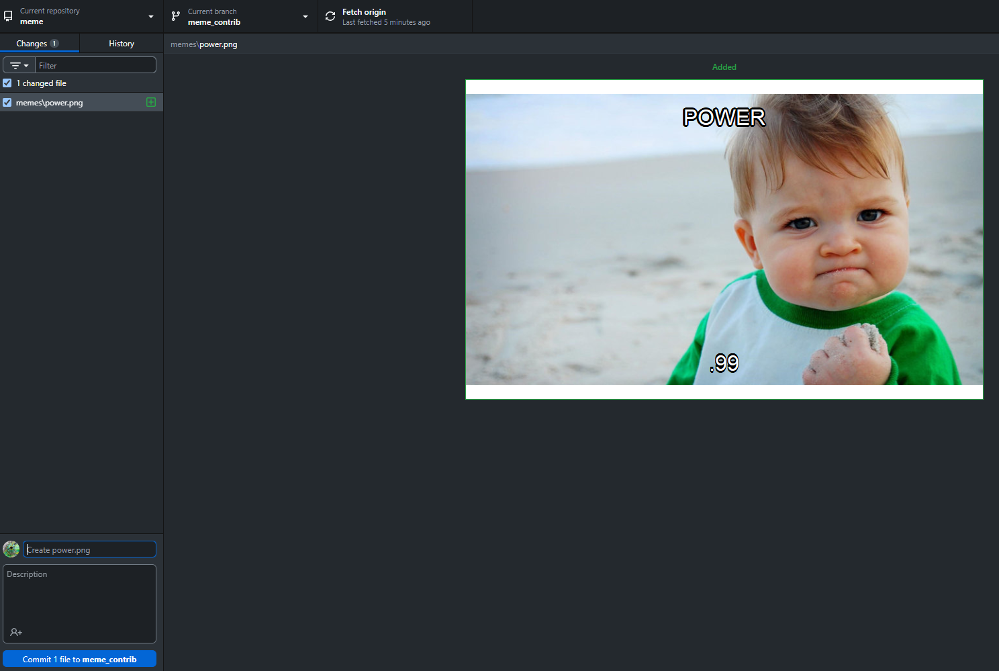

In this worksheet we are going to see two ways in which you can branch out from a repository and later make a request to ultimately merge with the original repository. Finally your are going to generate such request to contribute a meme. The best meme wins the day!

# Making a new branch on GitHub Desktop

Let's start with what happens with a repository that you own. You can use the repository that you have added before, for instance based on one of your project folders. You have the option to branch out from your local repository. Let's say you want another branch, you call "sandbox", where you try wild things. You want to preserve a main version where things just work.

You can branch out by selecting the "Current branch" button (next to the blue area in our visual summary) and press "new branch".

Try it out. What do you see?

You will be asked on GitHub Desktop to publish the branch so it is available remotely. Notice how "Current branch" says "sandbox".

Press "Publish branch" and "View on Github". Notice how you can see you have two branches now you can pick from. By default the main branch is selected.



# Pull request

You have another option on GitHub Desktop, which is "Preview pull request" and "Create pull request".

Do "View in Explorer", make a change in the sandbox and go back to GitHub Desktop. What happens when you try to switch back to the "master" branch? You can switch branch and "stash" changes in sandbox. Do "View in Explorer" again and look for the change. What happened here?

Your folder contains two alternate states, changes you make in sandbox and those you make in the master versions.

Now go back to the sandbox branch. "View the stash", then "Restore", then "commit" that change, then "push origin", then "Create a pull request". This will now lead you to the remote repository where you can comment on the proposed merger and explain yourself. Then confirm the "Create pull request". Finally you can "Merge pull request" finalizing the merger. If it is your repository you are branching from there is no further approval required. Don't forget to go back to the "master branch" after the merger.

# Forking a repository from GitHub Desktop

The other scenario is when you have a repository own by somebody else to which you want to contribute. We are going to start by *forking* a meme repository on GitHub (following best practice, rather than directly cloning, but we could actually do the cloning and then the forking from GitHub desktop). This process allows us to create a personal copy of the repository that maintains a connection to the original source. *Forking* is different from *cloning*; while cloning creates a local copy of the repository without a link to the original, forking allows us to contribute back to the original repository and track changes.

By doing this, we can access ways in which different people can work on different versions of the repository and manage the integration or **merging** into the original repository.

**Fork** the meme repository here: <https://github.com/DavidSouto/meme>, by pressing the **Fork** button. You are given the option to chose a new name and proceed. In GitHub Desktop, go to the File menu and select Clone Repository. Pick the GitHub.com tab and select from your repositories the one you just forked and press add.

You will be asked whether you plan to use it for your own or to contribute.

At this stage, if you do "View on GitHub" it will point you to the original repository, not your copy on GitHub. You can make a change, commit and then *push*. It will indeed push the change to your version of the repository. You can verify that by looking at your copy on GitHub.

# Contribute to the original repository

Now, we made all this to contribute to the original repository eventually, not our own copy. To do so, go to "Current branch" and create a new branch, which you name "meme_contrib" for instance. "Publish branch" as suggested.

Now you can make local changes. Such as adding a new meme to the meme folder. Select "View in Explorer" and check the "memes" folder.

Now you have the option to "Create pull request" or "Preview pull request".

# Meme contest

In this contest you will produce a meme that you will contribute to the meme repository. The best meme—based on relevance, impact and aesthetic value—wins the day!

Here is an example of usage of the meme library. It is a very simple library. You would need to put an image (.jpg or .png) in the working directory (or pick from the ones available), load it in the following way and add a caption.

Here is a [meme database](https://knowyourmeme.com/memes) you can draw inspiration from.

```{r warning=FALSE}
# uncomment to install 
# install.packages("meme")
library(meme)

# this should be quite self-explanatory
meme("images/angry8.jpg", "code", "all the things!", font = "Helvetica")
```

# How to save your meme

Once you have created your meme, you can save it simply by right clicking on the image (or via code, e.g. `png()` or `jpeg()`) and save to the `memes` folder.

Name your meme: "Name_Surname_xxx", it can be either .jpg or .png.

# Merge request to contribute your meme to the meme repo

You should see the following



Note that on top, on the left hand side you see Current repository: meme, then Current branch: *meme_contrib*. You can see the changes.

Now commit that change and *push to origin*. This will push to your branch. Now "View on GitHub". Again this leads you to the main branch. But you should now see that there are many branches. You could ask for a *pull request* there or through GitHub Desktop.

In GitHub Desktop as to *Preview pull request*: You can now see the changes that are being contributed, that the request is to *merge* 1 commit into *base:main* from *meme_contrib* (or the name of your branch).

Now *Create a pull request*. This leads you again to GitHub. Describe your contribution confirm the pull request.

The repository owner can now accept the merging with your contributed code.

# Options

If you go to the Setting associated to a repository on GitHub, you will see a plethora of options. In the General settings you have many options for *Pull requests*. For the meme repo I have set Allow *auto-merge*, once reviews and status checks have been passed, which can facilitate contributions at the risk of losing control.

You can now go to the original repository and verify that your meme is there. You should also see that your contribution appears in the history (give it a minute) of the main repository.

# Deleting a repository

Finally, since we are on the options menu you can see how you can delete a repository you are not using anymore. The option to delete is at the very bottom of the Settings. You will see a stern warning and you will need to confirm with the name of the repository.
