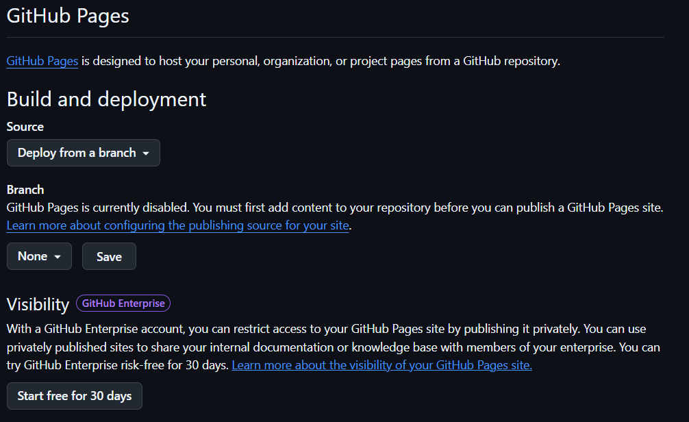

# Introduction

To cap our introduction to version control with GitHub, in this
worksheet we are going to publish this document as an .html file hosted
on GitHub.

This you could use in many ways. Why not use it as a virtual handout in
a conference (pointed at via a QR code), linked to your poster or
presentation, where people can see extended data or demonstrations.

You could use, for instance, insert video that you uploaded on
[FigShare](https://figshare.com/), one solution to store media and data.
If you are at UoL you can use the [institutional
figshare](http://figshare.le.ac.uk/).

# Start

Start by creating a repository. The repository has to be **public**
unless you have a pro account.

The repository name has to be <name>.github.io and not simply <name>,
for instance fog.github.io. Make sure it is public.

Note the published page will be public even if the repository is
private.

# Create your site

Now clone this repository locally and put this file page in there.

Navigate to your repository on GitHub and do **Set up in Desktop**. This
is a way of quickly cloning this repository locally. Now you see that
instead of options to **Push** or **Fetch**, you have an option to
*publish branch*. Save this file in that repository with "save as" and
change the working directory to that folder. Commit changes on GitHub
Desktop and **publish branch**.

Now *View on GitHub*, and go to the **Settings** associated with this
repository and select **pages** on the left-hand side.

You should see the following



You need to select a branch you will deploy. Default is none. Select the
only option at this point, which is the **main** branch. You can keep
/(root), and save.

Finally, For it to be interpreted correctly it needs an index.html file.
We'll get this file by knitting this worksheet (you will see an .html
file in the working directory) and saving it as index.html in the local
website repository. **Commit** and **push to origin**.

Now **View on GitHub** \> **Settings** \> **Pages**. You should now see
that your site is live and the link to the site.

Your site will be found at this address:
<https://><username>.github.io/<name>.github.io.

# Further options

There are many options that go on top of the document and specify how it
should be knitted. We can go with the defaults on top but we could
change to something like that, specifying table of contents and a theme.

For instance, modify the header on top so instead of just defining a
simple html output you specify a style and a navigable table of
contents. *Knit* to see the result.

```         
title: "My R Markdown Report"
author: "Your Name"
date: "2025-05-10"
output: 
  html_document:
    toc: true
    toc_float: true
    theme: united
    highlight: tango
```

# How could we embed media?

You could use the [embed
package](https://cran.r-project.org/web/packages/vembedr/vignettes/embed.html)

```{r}
# install.packages("vembedr")
library("vembedr")
embed_url("https://www.youtube.com/watch?v=BD_n6ju9iRA")

```

# Additional resources

You can see here usage limits for [GitHub
Pages](http://docs.github.com/en/pages/getting-started-with-github-pages/github-pages-limits)

The process of creating a page is explained
[here](https://docs.github.com/en/pages/getting-started-with-github-pages/creating-a-github-pages-site)
in more detail.
